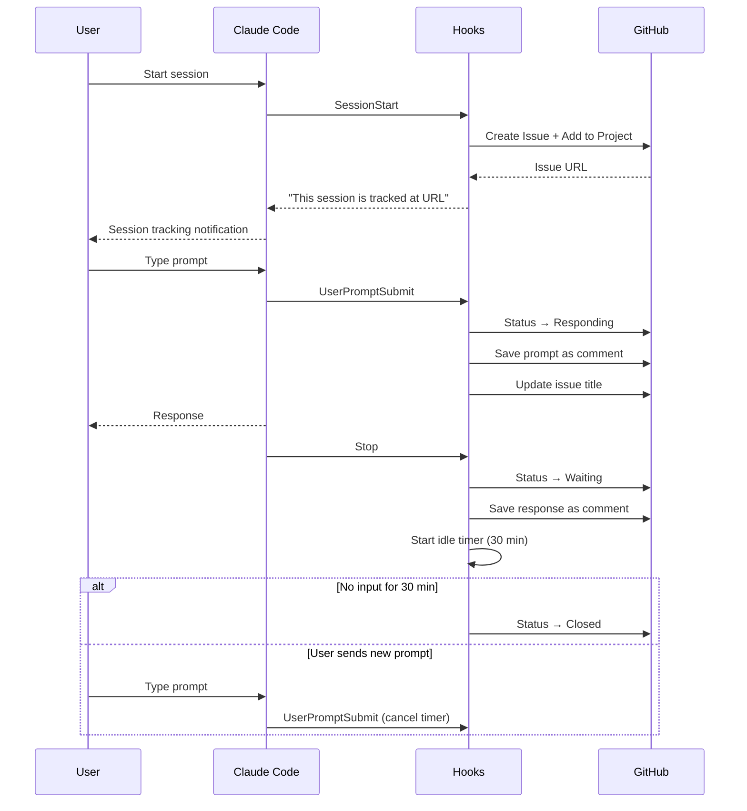

# claude-session-tracker

Automatically track your Claude Code sessions in GitHub Projects. Every prompt, every response, every decision — recorded as GitHub Issue comments, so you never lose context.


## Result

<p>
  
  
</p>


## Why?

Claude Code sessions are ephemeral. When a session ends, the conversation disappears. If you're working on multiple tasks across projects, it's hard to remember what happened, what was decided, and what's still pending.

**claude-session-tracker** solves this by:

- Creating a GitHub Issue for each session and linking it to your GitHub Project
- Recording every prompt and response as issue comments (with timestamps)
- Auto-updating the issue title with your latest prompt for quick scanning
- Tracking session lifecycle status in GitHub Projects (registered → responding → waiting → closed)
- Auto-assigning issues to you
- Supporting session resume without duplicate issues

## How It Works



| Claude Code Event | GitHub Projects Status | Action |
|---|---|---|
| `SessionStart` | Registered | Create GitHub Issue + add to Project |
| `UserPromptSubmit` | Responding | Save prompt as comment, update title |
| `PostToolUse` | — | Save AskUserQuestion selections as comment |
| `Stop` | Waiting | Save response as comment, start idle timer |
| Timer expires | Closed | Auto-close after configurable timeout (default: 30 min) |

## Prerequisites

- Node.js 18+
- Python 3
- [GitHub CLI (`gh`)](https://cli.github.com) — run `gh auth login` first
- A [GitHub Project (v2)](https://docs.github.com/en/issues/planning-and-tracking-with-projects) with a **Status** field

## Install

```bash
npx claude-session-tracker
```

The interactive wizard will guide you through:

1. **GitHub Project Owner** — your username or org
2. **GitHub Project Number** — the number in your project URL
3. **Status mapping** — map each lifecycle stage to your Project's Status options
4. **Default repo** — where to create issues when there's no git remote
5. **Idle timeout** — minutes before auto-closing (default: 30)
6. **Scope** — current project only or global

## Uninstall

```bash
npx claude-session-tracker uninstall
```

Safely removes only what was installed:
- Hook scripts (`cst_*.py`)
- Configuration (`config.env`)
- State files and logs
- Hook entries from `settings.json` (your other hooks are preserved)

## What Gets Installed

```
~/.claude/hooks/
├── cst_github_utils.py              # Shared utilities
├── cst_session_start.py             # SessionStart hook
├── cst_prompt_to_github_projects.py # UserPromptSubmit hook
├── cst_post_tool_use.py             # PostToolUse hook
├── cst_session_stop.py              # Stop / SessionEnd hook
├── cst_mark_done.py                 # Idle timeout handler
├── config.env                       # Your configuration
├── hooks.log                        # Execution logs
└── state/                           # Per-session state (JSON)
```

## Features

### Session URL Notification

When a session starts, Claude will inform you of the tracking URL:

> This session is being tracked at https://github.com/you/repo/issues/42

### Smart Title Updates

The issue title auto-updates with your latest prompt in the format:

```
[project-name] your latest prompt here...
```

Project names longer than 20 characters are truncated with `...`.

### Resume Detection

When you resume a session with `claude --resume`, the tracker reuses the existing GitHub Issue instead of creating a duplicate.

### Git Remote Auto-Detection

If your working directory has a GitHub remote, issues are created in that repository. Otherwise, they go to your configured default repo.

### All Hooks Run Async

Every hook runs with `async: true`, so tracking never blocks your workflow.

## Configuration

Edit `~/.claude/hooks/config.env` directly, or re-run `npx claude-session-tracker`.

```env
GITHUB_PROJECT_OWNER=your-username
GITHUB_PROJECT_NUMBER=1
GITHUB_PROJECT_ID=PVT_...
GITHUB_STATUS_FIELD_ID=PVTSSF_...
GITHUB_STATUS_REGISTERED=...
GITHUB_STATUS_RESPONDING=...
GITHUB_STATUS_WAITING=...
GITHUB_STATUS_CLOSED=...
NOTES_REPO=your-username/dev-notes
DONE_TIMEOUT_SECS=1800
```

## License

MIT
